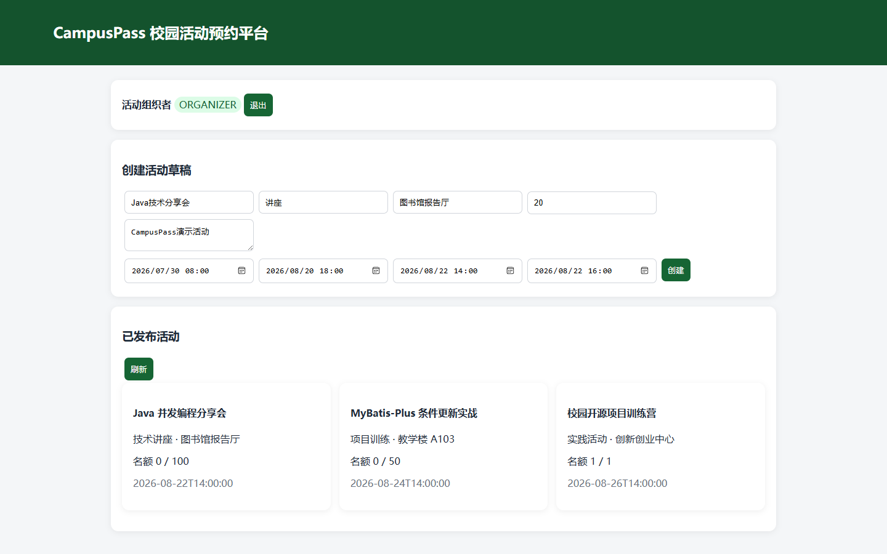
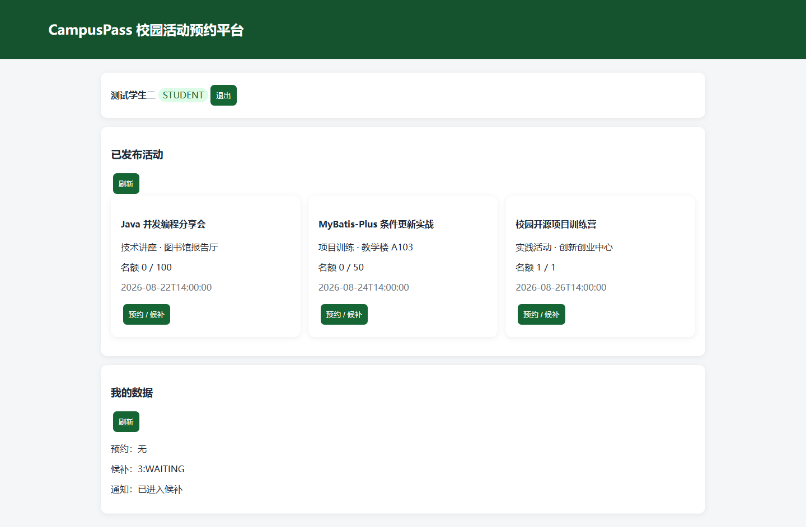
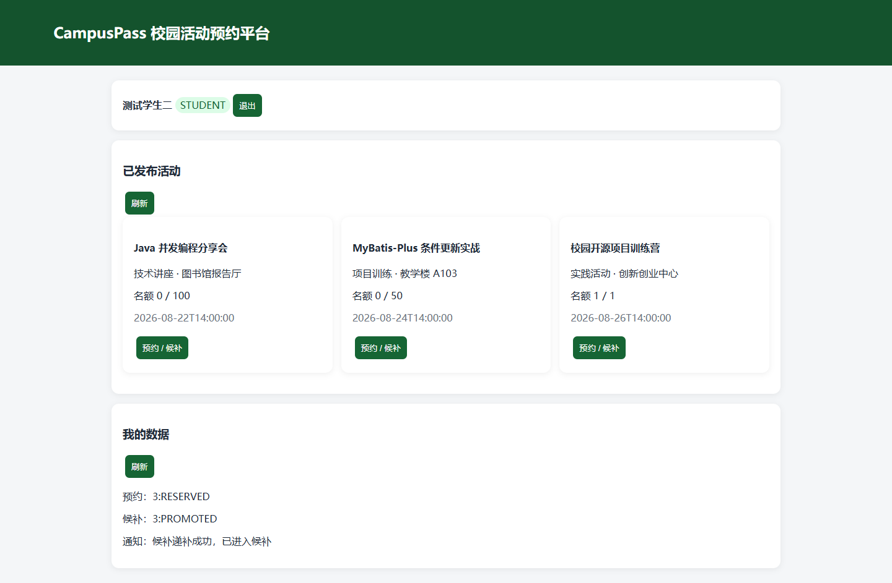
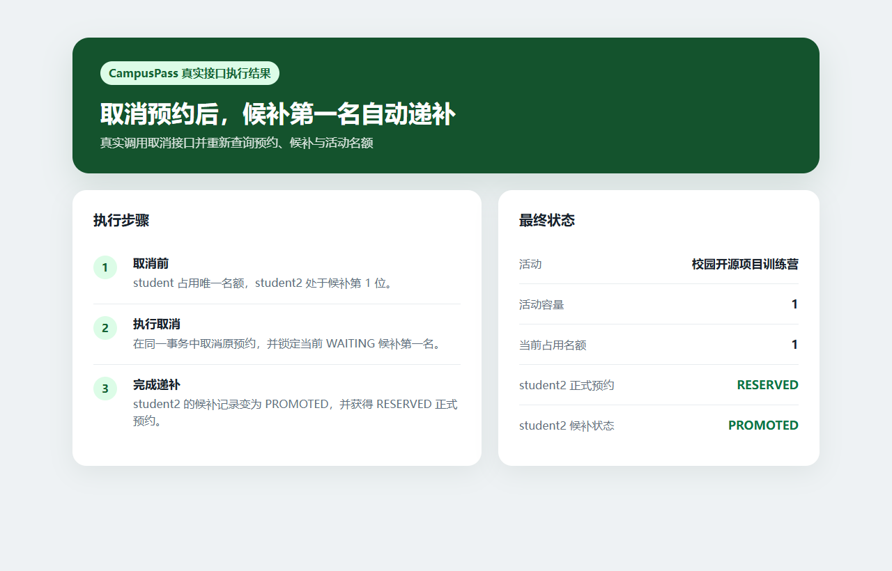
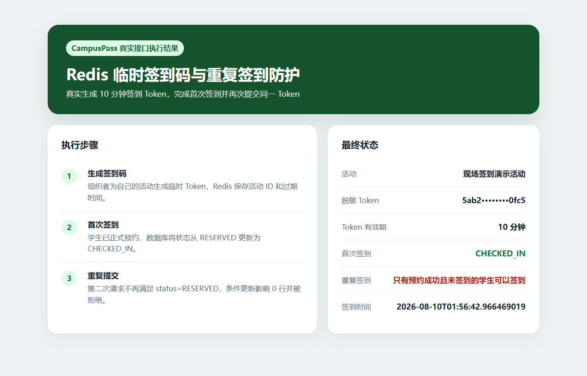
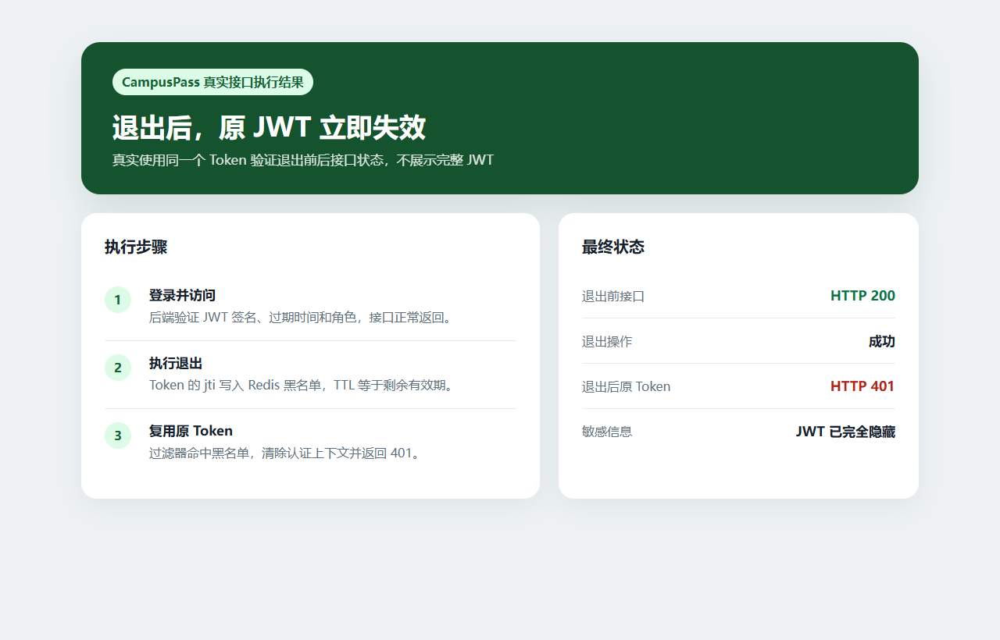
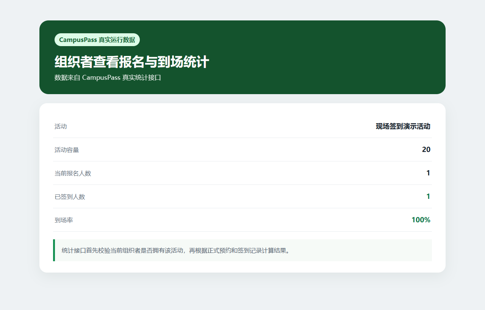
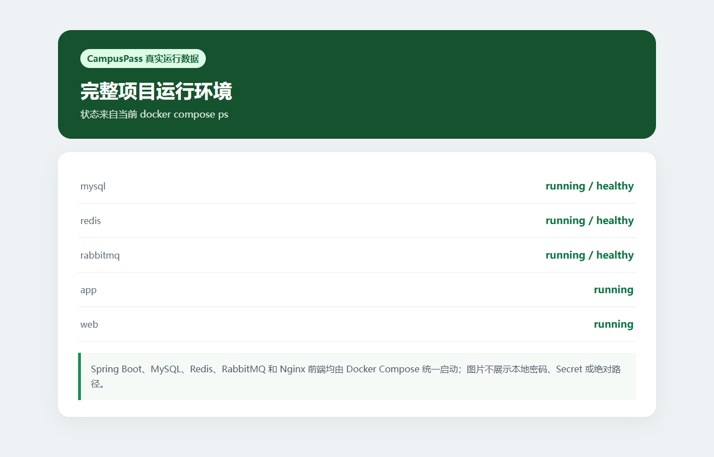
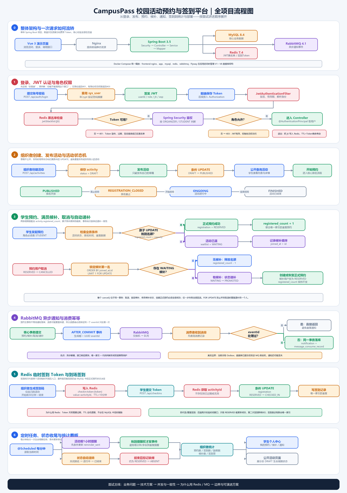
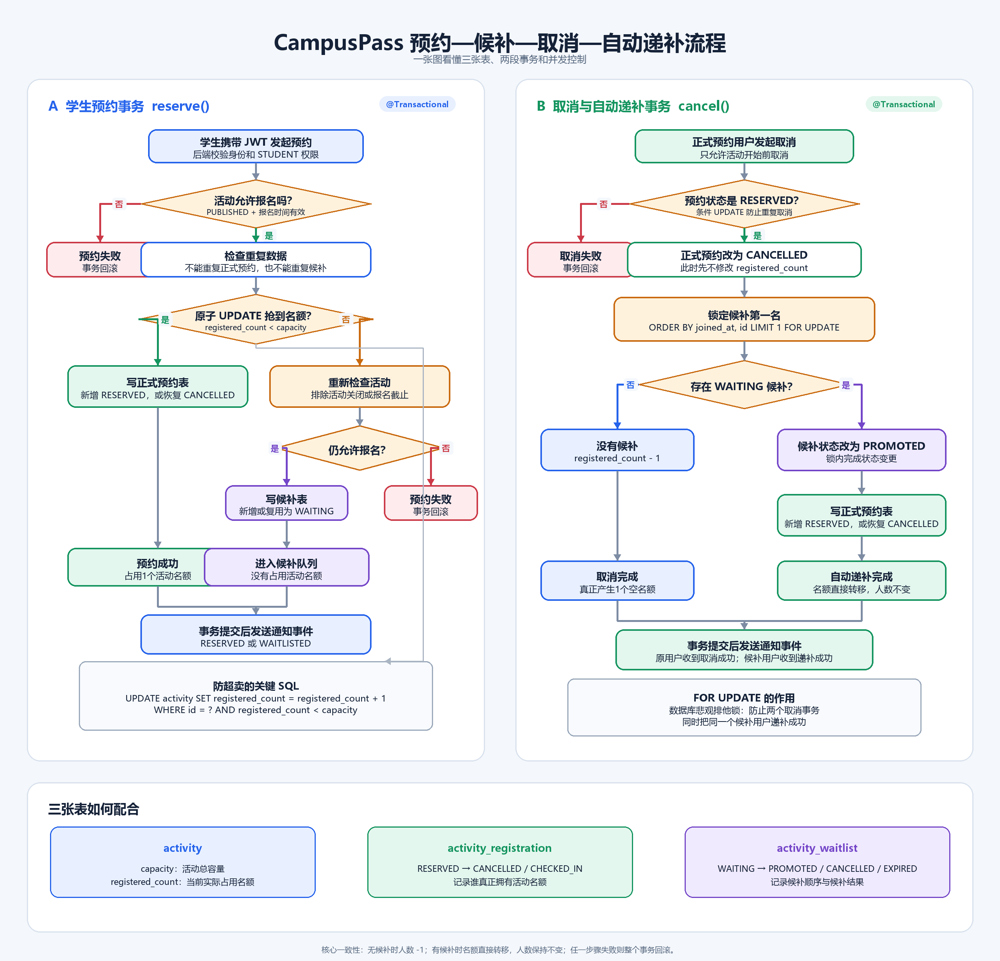

# CampusPass 校园活动预约签到平台

> 面向校园讲座、竞赛和志愿活动，完成活动发布、在线预约、满员候补、取消递补、消息提醒、现场签到和到场统计的完整业务链路。

  

## 这个项目解决什么问题

校园活动常通过群接龙或表格报名，容易出现名额统计不准、满员后没有候补顺序、用户取消后需要人工联系下一名，以及签到和到场率依赖人工登记等问题。

CampusPass 将流程统一为：

~~~text
组织者发布活动
      ↓
学生在线预约 ── 满员 ──→ 进入候补
      ↓                    ↓
预约成功 ←── 用户取消后按顺序自动递补
      ↓
开场提醒 → 现场签到 → 报名与到场统计
~~~

## 核心链路已经实际跑通

| 预约成功 | 满员候补 |
| --- | --- |
|  |  |

容量为 1 的活动中，student 先获得正式名额，student2 再请求时进入候补；当 student 取消后，student2 自动从 WAITING 变为 PROMOTED，并获得 RESERVED 正式预约。

| 递补后的学生状态 | 取消递补结果 |
| --- | --- |
|  |  |

## 我做了哪些工程设计

### 1. 条件 UPDATE 防止名额超卖

预约时不采用“先查询余量，再由 Java 判断”的方式，而是将容量、活动状态和报名时间合并到一条条件更新中：

~~~sql
UPDATE activity
SET registered_count = registered_count + 1
WHERE id = ?
  AND status = 'PUBLISHED'
  AND registration_start_time <= ?
  AND registration_end_time > ?
  AND registered_count < capacity;
~~~

- 影响 1 行：占位成功，写入正式预约。
- 影响 0 行：重新检查活动状态；若只是满员，则进入候补。
- UNIQUE(activity_id, user_id)：防止同一学生重复预约。

条件 UPDATE 负责“总人数不超过容量”，联合唯一索引负责“同一学生不重复”，两者保护不同的业务约束。

### 2. 事务与行锁保证取消递补顺序

取消预约与候补递补在同一个 MySQL 事务中完成：

1. 将原正式预约从 RESERVED 更新为 CANCELLED。
2. 使用 SELECT ... FOR UPDATE 锁定当前活动的首条 WAITING 候补记录。
3. 将候补状态更新为 PROMOTED。
4. 为候补用户创建或恢复 RESERVED 正式预约。
5. 如果没有候补用户，才释放活动名额。

这样并发取消时，多个事务不会同时递补同一个学生。

### 3. RabbitMQ 通知与消费幂等

预约、候补、取消、递补和开场提醒在业务事务提交后发送到 RabbitMQ。每个通知事件具有唯一 eventId，消费者通过消费记录和数据库唯一约束避免相同事件重复生成通知。

  

### 4. Redis 处理短期状态

Redis 在项目中承担两个明确职责：

- JWT 黑名单：退出时写入 Token 的 jti，TTL 等于 Token 剩余有效期。
- 临时签到码：保存活动签到 Token，TTL 为 10 分钟。

签到时只允许预约状态从 RESERVED 更新为 CHECKED_IN。第一次影响 1 行；第二次不再满足条件，因此能够防止重复签到。

| 现场签到与防重 | JWT 退出即时失效 |
| --- | --- |
|  |  |

## 真实运行结果

| 项目证据 | 实际结果 |
| --- | --- |
| 完整业务链 | 发布、预约、候补、取消递补、通知、签到和统计已实际执行 |
| 预约容量 | 容量 1 的活动最终始终保持 registered_count = 1 |
| 自动递补 | 候补用户由 WAITING 变为 PROMOTED，并获得 RESERVED 预约 |
| 重复签到 | 首次签到成功，第二次条件更新影响 0 行并被拒绝 |
| JWT 退出 | 退出前接口返回 200，复用原 Token 返回 401 |
| RabbitMQ | campuspass.notification.queue 存在，消费者在线 |
| 运行环境 | MySQL、Redis、RabbitMQ 健康，后端与前端正常运行 |

| 报名与到场统计 | Docker Compose 运行状态 |
| --- | --- |
|  |  |

## 技术栈

| 分类 | 技术 | 项目中的用途 |
| --- | --- | --- |
| 后端 | Java 17、Spring Boot、Spring MVC | 接口和核心业务 |
| 权限 | Spring Security、JWT | 组织者/学生权限和身份认证 |
| 持久层 | MyBatis-Plus、MySQL | 活动、预约、候补、签到和通知数据 |
| Redis | Redis 7.4 | JWT 黑名单、10 分钟签到 Token |
| 消息队列 | RabbitMQ 4.1 | 预约、候补、递补和提醒通知 |
| 任务 | Spring Scheduling | 状态推进、开场提醒和缺席标记 |
| 数据库版本 | Flyway | 建表、索引和结构变更 |
| 运行环境 | Docker Compose、Nginx | 搭建完整本地运行环境 |
| 演示前端 | Vue 3 | 展示活动发布、预约和个人状态 |

## 项目结构

~~~text
campuspass/
├─ src/main/java/
│  └─ com/yan/campuspass/
│     ├─ activity/          活动创建、发布和状态推进
│     ├─ auth/              登录与退出
│     ├─ registration/      预约、取消和正式预约状态
│     ├─ waitlist/          候补与自动递补
│     ├─ notification/      RabbitMQ 通知与消费幂等
│     ├─ checkin/           Redis 签到 Token 与签到
│     └─ security/          JWT 与 Spring Security
├─ src/main/resources/
│  └─ db/migration/         Flyway 数据库迁移
├─ frontend/                Vue 3 演示页面
├─ compose.yaml             完整项目运行环境
└─ Dockerfile               Spring Boot 镜像构建
~~~

## 本地运行

环境要求：已安装并启动 Docker Desktop。

~~~powershell
cd campuspass
Copy-Item .env.example .env
docker compose up --build -d
~~~

启动后：

- 演示页面：<http://localhost:3000>
- 后端接口：<http://localhost:8080>
- RabbitMQ 管理页：<http://localhost:15673>

演示账号密码均为 CampusPass123!：

| 账号 | 角色 | 用途 |
| --- | --- | --- |
| organizer | ORGANIZER | 创建、发布和查看统计 |
| student | STUDENT | 预约、取消和签到 |
| student2 | STUDENT | 候补和自动递补 |

本地数据库、RabbitMQ 和 JWT 配置保存在 campuspass/.env。该文件已被 Git 忽略，可公开模板为 campuspass/.env.example。

## 完整流程图

查看 CampusPass 全项目流程图

  

查看预约、候补与取消递补详细流程

  

## 详细文档

[查看 CampusPass 的完整接口、业务规则与启动说明](campuspass/README.md)
