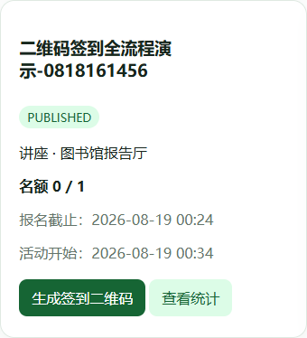
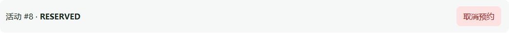
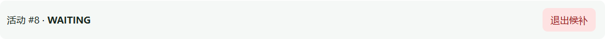
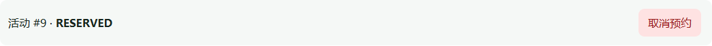
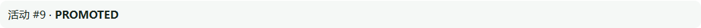
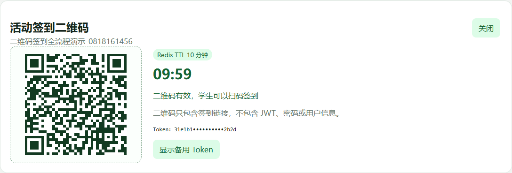
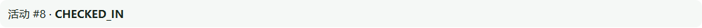
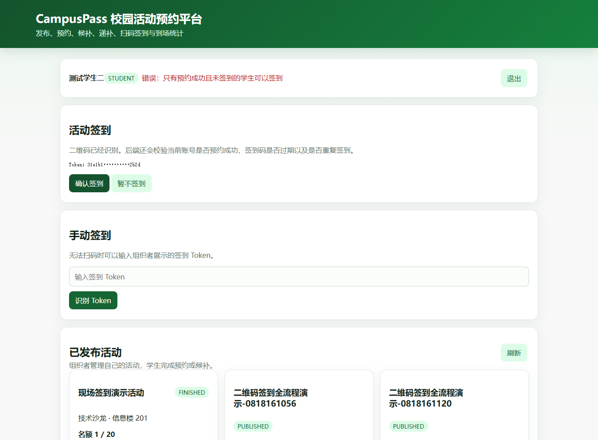
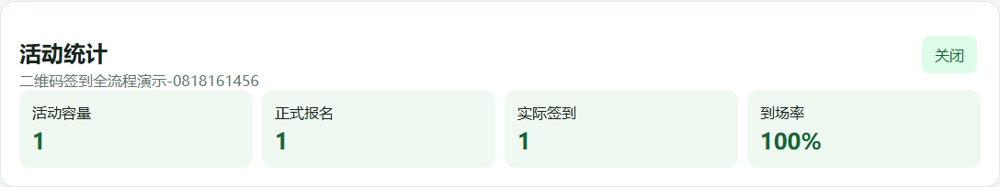
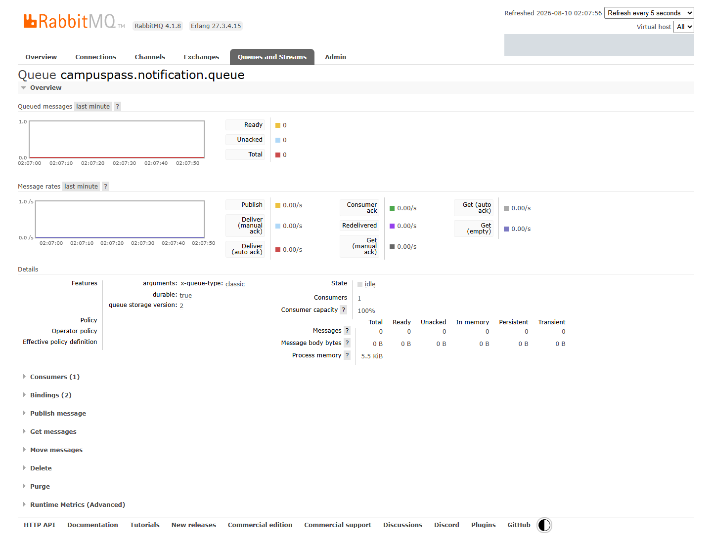

# CampusPass 校园活动预约与二维码签到平台

CampusPass 面向校园讲座、竞赛和志愿活动，解决微信群接龙容易重复、活动名额难控制、满员后没有候补顺序、取消后依赖人工递补以及现场签到和到场统计繁琐的问题。

系统提供一条完整业务链：

> 组织者发布活动 → 学生预约 → 满员候补 → 取消自动递补 → 生成临时二维码 → 学生扫码签到 → 组织者查看到场统计

## 项目功能

| 使用者 | 功能 |
|---|---|
| 组织者 | 创建草稿、发布活动、生成签到二维码、查看报名和到场统计 |
| 学生 | 浏览活动、预约、候补、取消、扫码签到、查看站内通知 |
| 系统 | 控制活动容量、按顺序自动递补、异步生成通知、推进活动状态、标记缺席 |

## 完整业务流程

~~~mermaid
flowchart LR
    A["组织者创建并发布活动"] --> B["学生发起预约"]
    B --> C{"活动还有名额吗？"}
    C -- "有" --> D["正式预约 RESERVED"]
    C -- "没有" --> E["进入候补 WAITING"]
    D --> F["正式预约者取消"]
    E --> F
    F --> G["候补第一名自动递补"]
    G --> H["组织者生成临时二维码"]
    H --> I["学生扫码并确认签到"]
    I --> J["预约状态变为 CHECKED_IN"]
    J --> K["组织者查看到场统计"]
~~~

### 1. 组织者发布活动

组织者填写活动容量、报名时间和活动时间，先创建草稿，确认后再发布。只有已发布且处于报名时间内的活动可以预约。

### 2. 学生预约，满员后进入候补

活动有名额时生成正式预约；名额已满时不增加报名人数，而是按照加入时间进入候补名单。

| 正式预约 | 满员候补 |
|---|---|
|  |  |

### 3. 取消后自动递补

正式预约者取消时，系统在同一事务中选择候补第一名，将其候补状态改为 PROMOTED，并创建 RESERVED 正式预约。名额只是从取消者转交给候补者，因此活动已占用人数保持不变。

递补完成后，学生端会同时看到正式预约和已递补候补记录：

| 递补后的正式预约 | 候补记录已经完成递补 |
|---|---|
|  |  |

### 4. 组织者生成签到二维码

活动开始前 30 分钟至活动结束期间，组织者可以为自己创建的活动生成签到 Token。前端把签到链接渲染成二维码，并显示十分钟倒计时。

Redis 保存：

~~~text
Key:   checkin:token:{token}
Value: activityId
TTL:   10 分钟
~~~

二维码只包含临时签到链接，不包含 JWT、密码或用户信息。页面中的备用 Token 默认脱敏。

### 5. 学生扫码签到

学生扫码后先完成登录。后端使用 JWT 确认当前学生身份，根据 Redis Token 找到活动，再检查 MySQL 中是否存在 RESERVED 正式预约。

第一次签到将预约状态更新为 CHECKED_IN：

相同学生再次提交时，状态已经不是 RESERVED，条件更新影响零行，系统拒绝重复签到：

### 6. 组织者查看到场统计

组织者只能查看自己创建的活动，页面展示活动容量、正式报名人数、实际签到人数和到场率。

## 核心工程设计

### MySQL 条件 UPDATE 防止超卖

预约不采用“先查人数、再加一”，而是让 MySQL 在一条 SQL 中同时检查活动状态、报名时间和剩余容量：

~~~sql
UPDATE activity
SET registered_count = registered_count + 1
WHERE id = #{activityId}
  AND status = 'PUBLISHED'
  AND registration_start_time <= #{now}
  AND registration_end_time > #{now}
  AND registered_count < capacity;
~~~

- 影响 1 行：成功占用名额，创建正式预约。
- 影响 0 行：没有占到名额；活动仍可报名时进入候补。
- activity_id 与 user_id 联合唯一索引防止同一学生重复预约。
- 占用名额和插入预约记录位于同一事务，任一步失败都会整体回滚。

### 事务与行锁保证候补顺序

取消预约和自动递补在一个事务中完成。查询候补第一名时使用：

~~~sql
SELECT *
FROM activity_waitlist
WHERE activity_id = #{activityId}
  AND status = 'WAITING'
ORDER BY joined_at ASC, id ASC
LIMIT 1
FOR UPDATE;
~~~

并发取消时，后一个事务等待前一个事务提交，再选择下一条仍为 WAITING 的候补记录，避免多个名额重复递补给同一学生。

### RabbitMQ 异步通知与消费幂等

预约、候补、取消、递补和开场提醒完成后产生通知事件：

~~~mermaid
flowchart LR
    A["核心数据库事务"] --> B["事务提交成功"]
    B --> C["发送 RabbitMQ 消息"]
    C --> D["通知消费者"]
    D --> E["检查 eventId"]
    E --> F["保存站内通知和消费记录"]
~~~

- 使用 Spring 事务事件在 AFTER_COMMIT 阶段发送，避免业务回滚却出现成功通知。
- 每条事件包含唯一 eventId。
- 消费记录表和通知表的唯一索引共同防止重复消息生成多条通知。
- 当前实现保证提交后发送和消费幂等；生产环境可继续增加 Outbox、Publisher Confirm、重试与死信队列。

下面是项目运行时的真实 RabbitMQ 管理页面，可以看到通知队列和消费者：

### Spring Security、JWT 与 Redis 黑名单

- 登录成功后签发 JWT，前端在后续请求中携带 Bearer Token。
- 后端验证签名、过期时间、Redis 黑名单和角色权限。
- STUDENT 负责预约与签到，ORGANIZER 负责发布、生成二维码和查看统计。
- 用户退出时把 JWT 的 jti 写入 Redis，TTL 等于 Token 剩余有效期，使旧 Token 立即失效。

### Redis 临时签到 Token

JWT、签到 Token 和 MySQL 分别回答三个问题：

| 数据 | 回答的问题 |
|---|---|
| JWT | 当前用户是谁？ |
| Redis 签到 Token | 要签到哪场活动，Token 是否过期？ |
| MySQL 正式预约 | 当前学生是否有资格，是否已经签到？ |

同一活动的多名学生可以共用二维码，因此 Token 不会在第一次使用后删除。防重复签到依靠 RESERVED 到 CHECKED_IN 的条件更新，以及 activity_id 与 user_id 的签到联合唯一索引。

### Spring Scheduling 自动推进活动

每分钟扫描活动时间和当前状态：

- 活动开始前一小时生成开场提醒。
- 报名截止后关闭报名。
- 到达开始时间后切换为进行中。
- 到达结束时间后切换为已结束。
- 将活动结束后仍未签到的正式预约标记为缺席。

条件更新和 reminder_sent 标记使任务可以重复运行，也能在服务短暂停止后根据当前时间补推进状态。

## 技术架构

~~~mermaid
flowchart LR
    U["浏览器"] --> N["Nginx + Vue 3"]
    N --> B["Spring Boot 单体后端"]
    B --> M["MySQL\n活动、预约、候补、签到"]
    B --> R["Redis\nJWT 黑名单、签到 Token"]
    B --> Q["RabbitMQ\n异步通知"]
    Q --> C["通知消费者"]
    C --> M
~~~

| 分类 | 技术 |
|---|---|
| 后端 | Java 17、Spring Boot、Spring Security |
| 数据访问 | MyBatis-Plus、MyBatis 注解 SQL、MySQL |
| 中间件 | Redis、RabbitMQ |
| 认证 | JWT、BCrypt、RBAC |
| 自动任务 | Spring Scheduling |
| 前端演示 | Vue 3、QRCode.js、Nginx |
| 运行环境 | Docker Compose |

## 一键启动

环境要求：安装并启动 Docker Desktop。

~~~powershell
Copy-Item .env.example .env
docker compose up --build -d
~~~

启动后：

| 服务 | 地址 |
|---|---|
| CampusPass 页面 | http://localhost:3000 |
| 后端接口 | http://localhost:8080 |
| RabbitMQ 管理页面 | http://localhost:15673 |
| MySQL | localhost:3307 |
| Redis | localhost:6380 |

.env 保存本地数据库、RabbitMQ 和 JWT 配置，已被 .gitignore 忽略；.env.example 只提供本地演示占位值。

## 演示账号

演示密码统一为 CampusPass123!。

| 账号 | 角色 | 演示用途 |
|---|---|---|
| organizer | ORGANIZER | 创建、发布、生成二维码、查看统计 |
| student | STUDENT | 正式预约后取消 |
| student2 | STUDENT | 候补、自动递补、扫码签到 |

## 推荐演示步骤

前端的活动时间默认根据当前时间生成，容量默认为 1，方便直接走完整链路。

1. 使用 organizer 创建并发布活动。
2. 使用 student 预约，占用唯一名额。
3. 使用 student2 预约，进入候补。
4. student 取消，观察 student2 自动递补。
5. organizer 点击“生成签到二维码”。
6. student2 扫码、登录并确认签到。
7. 再次使用相同二维码，观察重复签到被拒绝。
8. organizer 打开统计，查看签到人数和到场率。

如果使用手机扫描本地二维码，组织者页面需要通过同一局域网可访问的地址打开，例如 http://局域网IP:3000；二维码会使用当前页面地址生成。使用 localhost 生成的二维码只适合同一台电脑演示。

## 主要接口

| 方法 | 路径 | 权限 | 说明 |
|---|---|---|---|
| POST | /api/auth/login | 公开 | 登录并获取 JWT |
| POST | /api/auth/logout | 登录用户 | 退出并拉黑当前 JWT |
| GET | /api/activities | 公开 | 查询已发布活动 |
| POST | /api/activities | ORGANIZER | 创建活动草稿 |
| POST | /api/activities/{id}/publish | ORGANIZER | 发布活动 |
| POST | /api/activities/{id}/registrations | STUDENT | 预约或进入候补 |
| DELETE | /api/activities/{id}/registrations/me | STUDENT | 取消正式预约 |
| DELETE | /api/activities/{id}/registrations/waitlist/me | STUDENT | 退出候补 |
| POST | /api/activities/{id}/checkin-token | ORGANIZER | 生成临时签到 Token |
| POST | /api/checkins | STUDENT | 提交 Token 签到 |
| GET | /api/me/notifications | 登录用户 | 查看站内通知 |
| GET | /api/activities/{id}/stats | ORGANIZER | 查看报名与到场统计 |

## 项目结构

~~~text
src/main/java/com/yan/campuspass
├─ activity       活动草稿、发布、状态和定时任务
├─ auth           登录与退出
├─ security       JWT 认证、黑名单和角色权限
├─ registration   预约、取消和名额控制
├─ waitlist       候补与自动递补
├─ notification   RabbitMQ 通知和消费幂等
├─ checkin        Redis Token 与签到
├─ dashboard      学生数据和组织者统计
└─ common         统一响应和异常处理
~~~
